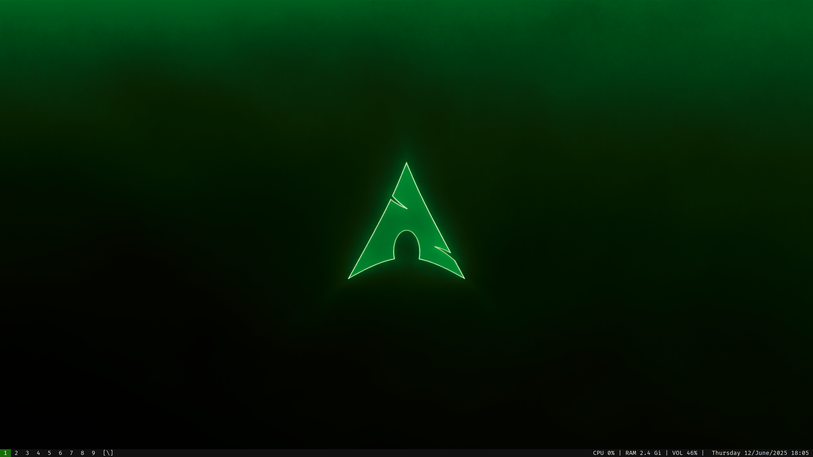
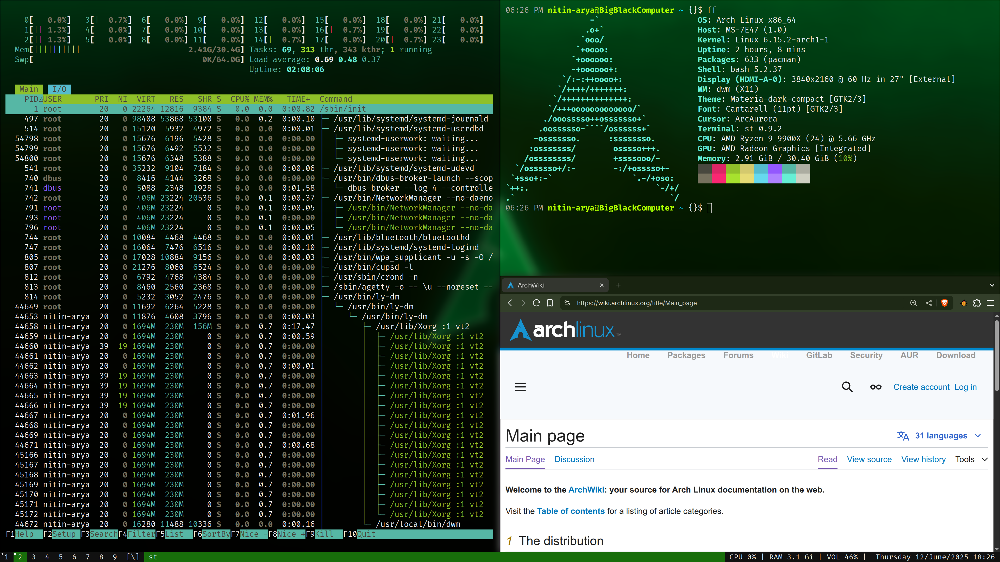
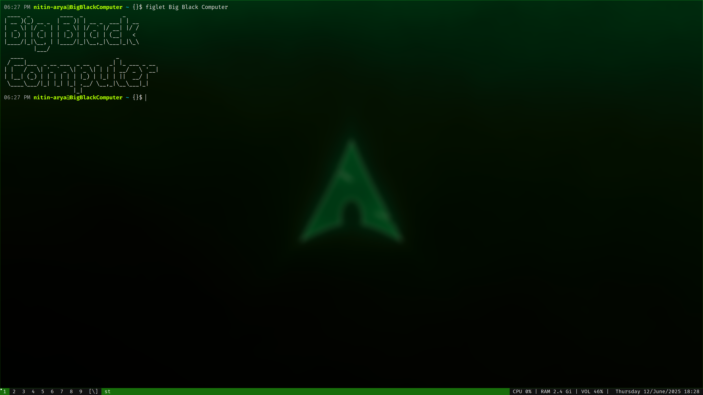
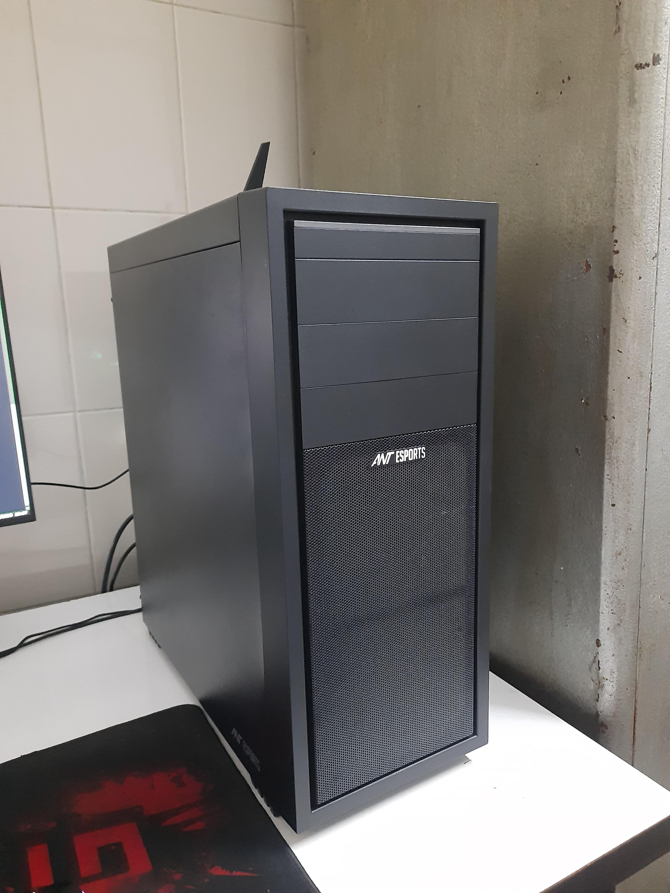

# My Suckless software for Arch linux (X11)

---

Hello, I am sharing my files on this repo to keep them as a backup as well as for other people to use if they like my ricing. I have designed my desktop to be as fast, light-weight and snappy as possible, which was not that hard because of how simplistic and bloatfree suckless software is to begin with. I love the modularity of it, if I need something I can just patch it in the software. 

No useless feature. No useless bloat.

---

### Patches I used for the for the software:
1. DWM (Dynamic Window Manager) : vanity_gaps and always_center. both for aesthetic reasons; I didn't need anything else for now
2. ST (Simple terminal) : alpha_focus and scroll_back
3. SLSTATUS: none
4. SLOCK: none
5. DMENU: I use this by installing from pacman as it doesn't need much modifications and colors can be changed trhou DWM itself.

---	

---

---

---

This is reason for my hostname. its accurate. dont laugh!

---
My build is green themed but its not hard to modify. I suggest deleting the config.h and modify the config.def.h and then running the "sudo make clean install" command.

